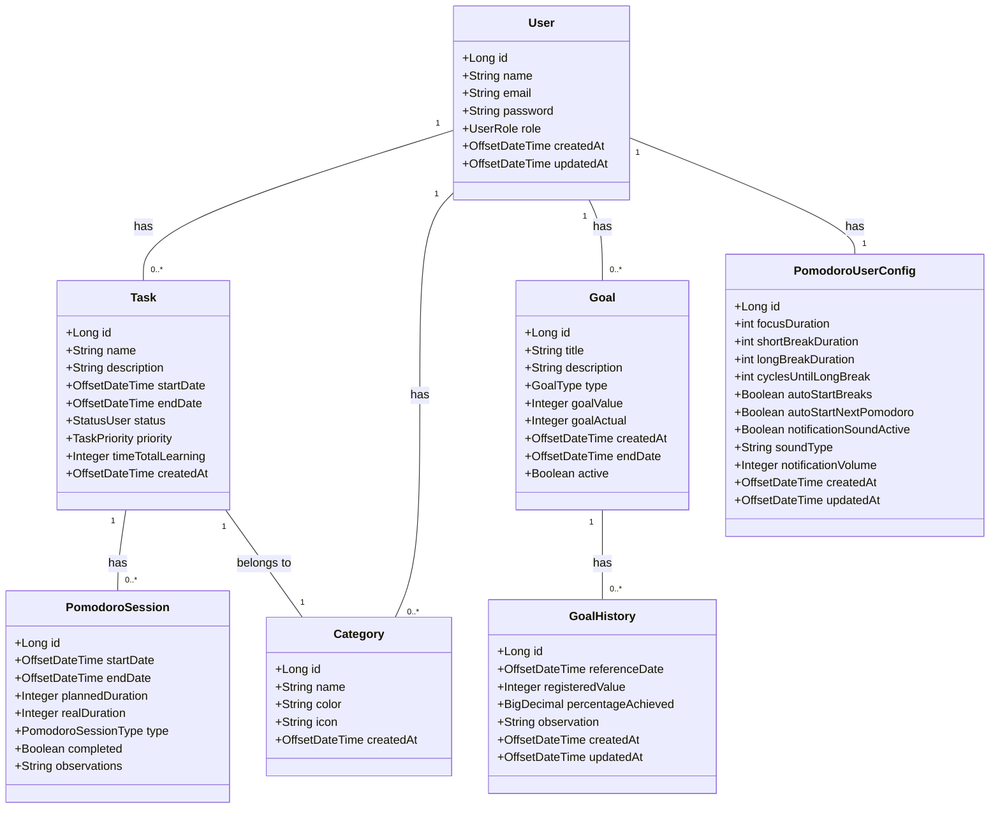

# PomoStudy API

API desenvolvida para gerenciar usuários, tarefas, metas e categorias do aplicativo PomoStudy.

[](https://github.com/JRomualdoDev/PomoStudy/actions/workflows/maven.yml)

---

## 🚧  Próximos Passos

- [X] Criar testes
- [X] Paginação
- [X] Criar autenticação e autorização
- [ ] Criar interface
- [ ] Adicionar mais validações
- [X] Implementar CI/CD
- [ ] Adicionar novos recursos

---

## 🚀 Teste a API

### [**👉 Clique aqui para testar a API no Swagger UI**](https://pomostudy.onrender.com/swagger-ui/index.html) 👈

---

<details>
<summary><strong>Tecnologias Utilizadas</strong></summary>

- Java 21
- Spring Boot 3.4.0
- Spring Web
- Spring Data JPA
- PostgreSQL
- Maven
- SpringDoc OpenAPI (Swagger)

</details>

<details>
<summary><strong>O que foi aprendido neste projeto</strong></summary>

Este projeto foi uma oportunidade de aprofundar conhecimentos em desenvolvimento de APIs REST com Spring Boot, aplicando as melhores práticas do mercado. Abaixo, estão destacados os principais conceitos e tecnologias explorados:

### **Arquitetura e Design de API**

- **Arquitetura em Camadas:** A estruturação do projeto em camadas (Controller, Service, Repository) garantiu a separação de responsabilidades e a manutenibilidade do código.
- **DTOs (Data Transfer Objects):** Foram utilizados DTOs para desacoplar a representação dos dados da API das entidades do banco de dados, garantindo uma API mais flexível e segura.
- **Mapeamento de Objetos:** A implementação de mappers para converter DTOs em entidades e vice-versa automatizou o processo e evitou código repetitivo.
- **Validação de Dados:** O uso do Spring Boot Starter Validation e a criação de validadores customizados garantiram a integridade dos dados de entrada da API.
- **Tratamento de Exceções:** A implementação de um `GlobalExceptionHandler` centralizou o tratamento de exceções e o retorno de mensagens de erro consistentes para o cliente.
- **Documentação de API:** O SpringDoc OpenAPI (Swagger) foi utilizado para gerar a documentação da API de forma automática, facilitando o consumo da API por outros desenvolvedores.

### **Spring Boot e Ecossistema**

- **Spring Web:** O Spring Web foi o framework base para a criação dos endpoints da API REST.
- **Spring Data JPA:** O Spring Data JPA facilitou a persistência de dados com o PostgreSQL.
- **Injeção de Dependências:** A injeção de dependências do Spring foi fundamental para gerenciar os componentes da aplicação.
- **Spring Boot DevTools:** O Spring Boot DevTools agilizou o desenvolvimento com recursos como o live reload.

### **Banco de Dados**

- **PostgreSQL:** O PostgreSQL foi o banco de dados relacional escolhido para persistir os dados da aplicação.
- **H2 Database:** O H2 foi utilizado como banco de dados em memória para os testes automatizados.

### **Boas Práticas**

- **Enums:** Enums foram utilizados para representar conjuntos de valores fixos, como prioridade de tarefas e tipos de metas.
- **Tagging Interfaces:** Tagging interfaces foram aplicadas para agrupar validações em diferentes cenários (criação e atualização).
- **Testes:** Em construção.

</details>

<details>
<summary><strong>Como Executar o Projeto</strong></summary>

### **Pré-requisitos**

- Java 21
- Maven
- PostgreSQL

### **Configuração**

1.  **Clone o repositório:**
    ```bash
    git clone https://github.com/JRomualdoDev/PomoStudy.git
    ```
2.  **Configure o banco de dados:**
  - Crie um banco de dados PostgreSQL.
  - Atualize as configurações do banco de dados no arquivo `src/main/resources/application.properties`.
  - Caso queira usar o docker - Na pasta onde se encontra o arquivo docker-composer.yaml, executar no terminal docker-composer up -d

### **Executando a Aplicação**

```bash
mvn spring-boot:run
```

### **Executando os Testes**

```bash
mvn test
```

### **Acessando a Documentação da API (Swagger)**

Abra o seu navegador e acesse `http://localhost:8080/swagger-ui.html`.

</details>

<details>
<summary><strong>Endpoints da API</strong></summary>

A URL base para todos os endpoints é `/api`.

### Usuários

- **Criar Usuário**
  - `POST /user`
- **Editar Usuário**
  - `PUT /user/{id}`
- **Listar Todos os Usuários**
  - `GET /user`
- **Buscar Usuário por ID**
  - `GET /user/{id}`
- **Excluir Usuário**
  - `DELETE /user/{id}`

### Tarefas

- **Criar Tarefa**
  - `POST /task`
- **Editar Tarefa**
  - `PUT /task/{id}`
- **Listar Todas as Tarefas**
  - `GET /task`
- **Buscar Tarefa por ID**
  - `GET /task/{id}`
- **Excluir Tarefa**
  - `DELETE /task/{id}`

### Metas

- **Criar Meta**
  - `POST /goal`
- **Editar Meta**
  - `PUT /goal/{id}`
- **Listar Todas as Metas**
  - `GET /goal`
- **Buscar Meta por ID**
  - `GET /goal/{id}`
- **Excluir Meta**
  - `DELETE /goal/{id}`

### Categorias

- **Criar Categoria**
  - `POST /category`
- **Editar Categoria**
  - `PUT /category/{id}`
- **Listar Todas as Categorias**
  - `GET /category`
- **Buscar Categoria por ID**
  - `GET /category/{id}`
- **Excluir Categoria**
  - `DELETE /category/{id}`

</details>

<details>
<summary><strong>Class diagrams</strong></summary>


</details>

## Autor

- **José Romualdo**
- **LinkedIn:** [www.linkedin.com/in/j-romualdo](https://www.linkedin.com/in/j-romualdo)
- **GitHub:** [https://github.com/JRomualdoDev](https://github.com/JRomualdoDev)

## Licença

Este projeto está licenciado sob a licença MIT.